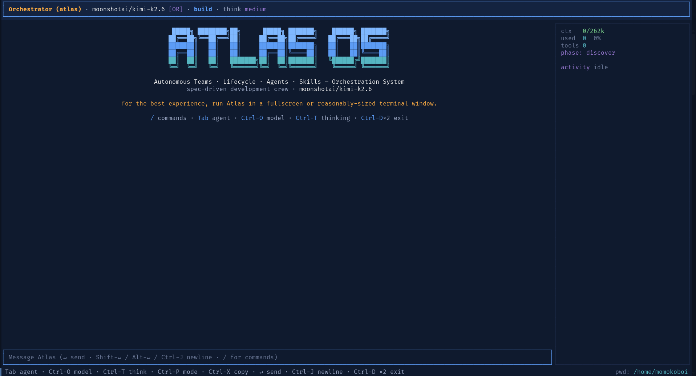

<div align="center">

# ATLAS·OS

**Autonomous Teams · Lifecycle · Agents · Skills — Orchestration System**

A multi-agent, hook-driven, model-agnostic engineering OS for the terminal.
Hand it a vague idea. Get back a planned, built, tested, committed feature —
with a Greek pantheon of specialist agents doing the work.

[](https://www.npmjs.com/package/atlas-os)
[](https://github.com/lucapohl-angel/ATLAS_OS)
[](LICENSE)

<br>

```bash
npx atlas-os@latest
```

**Works on macOS, Linux, and Windows through WSL2. Bring Anthropic Claude, OpenAI GPT, OpenRouter, OpenCode Zen, OpenCode Go, or run local Llama / Qwen / DeepSeek models through Ollama, LM Studio, vLLM, or llama.cpp.**

<br>



<br>

[Why I Built This](#why-i-built-this) ·
[How It Compares](#how-it-compares) ·
[Install](#install) ·
[How It Works](#how-it-works) ·
[Dev](#dev)

</div>

---

## Why I Built This

Atlas exists because most AI coding CLIs are either:

- a single chatbot that loses project shape after a few prompts, or
- a process you have to assemble yourself before it can help you ship.

ATLAS·OS keeps the flow simple (`atlas`, describe the goal, ship) while keeping
the engine serious: multi-agent orchestration, typed tools, hook-based safety,
and persistent project state.

---

## How It Compares

| Capability | **ATLAS·OS** | Claude Code | OpenCode | Gemini CLI | Kilo Code |
|---|---|---|---|---|---|
| Provider choice | Anthropic Claude · OpenAI GPT · OpenRouter · OpenCode Zen · OpenCode Go · local Llama/Qwen/DeepSeek via Ollama · LM Studio · vLLM · llama.cpp | Claude-focused | Provider-agnostic | Gemini-focused | Kilo router |
| Multi-agent orchestration | Built-in Greek pantheon, routed by project state | Agent teams + subagents | Build / Plan + subagent | Subagents | Modes |
| Spec-driven pipeline | Built-in PRD -> architecture -> stories -> implementation -> QA -> release | Bring your own | Bring your own | Bring your own | Bring your own |
| Lifecycle hooks | Typed TypeScript hooks around tools/messages | Hook system | Plugins / MCP | Hooks | Plugins / MCP |
| Agent skills | Built-in skill loader + learned skills | Skills | Skills | Skills | Skills |
| MCP servers | Built in: stdio + Streamable HTTP, configured from the TUI | Built in | Built in | Built in | Built in |
| Terminal-first | `atlas` opens the full-screen TUI | Terminal | Terminal | Terminal | VS Code-first, CLI available |
| License | MIT | Proprietary | MIT | Apache-2.0 | MIT |

Atlas's edge is not one isolated feature. It is the SDD pipeline, specialist
agents, typed hooks/tools, MCP integration, and release workflow shipped as one
terminal system.

---

## Install

### macOS

```bash
npx atlas-os@latest

# Or install globally
npm install -g atlas-os
atlas
```

### Linux

```bash
npx atlas-os@latest

# Or install globally
npm install -g atlas-os
atlas
```

Atlas checks npm for newer `atlas-os` releases when the TUI opens. If your
global install is behind, it shows a short dismissible update notice with:

```bash
npm install -g atlas-os@latest
```

### Windows

WSL2 is recommended for the full Atlas experience.

```powershell
# In an elevated PowerShell, one time:
wsl --install -d Ubuntu
```

Then inside Ubuntu:

```bash
sudo apt update && sudo apt install -y nodejs npm
npm install -g atlas-os
atlas
```

Native Windows can run the core CLI, but the shell tool expects POSIX commands.
Use WSL2 if you want tool execution to match Linux/macOS behavior.

### What Gets Installed

The package installs a small dispatcher plus the native binary for your platform.
Other platform binaries are optional dependencies and are skipped automatically.
If the native binary is unavailable, Atlas falls back to the bundled JS build on
Node.js 20+.

### VS Code Setup

The VS Code integrated terminal catches shortcuts like `Ctrl+P` before terminal
apps can see them. Run this once if you use Atlas inside VS Code:

```bash
atlas vscode-setup
# then reload VS Code
```

Use `--dry-run` to preview the settings change, or `--path <file>` for a
non-default VS Code settings file.

### VS Code Extension

The VS Code extension lives in `packages/vscode` and embeds the same
`@atlas/core` engine as the terminal app. For local testing:

```bash
pnpm --filter atlas-os-vscode run package
```

Then install `packages/vscode/dist/atlas-os-vscode.vsix` with
`Extensions: Install from VSIX...`. The extension reads `~/.atlas/config.yaml`,
layers explicit `atlas.*` VS Code settings on top, stores newly entered provider
keys in VS Code SecretStorage, and opens ChatGPT / Codex sign-in through the
Command Palette action `Atlas: Sign in to ChatGPT / Codex`.

### Providers

The easiest path is inside the TUI:

```bash
atlas
```

Then open `/config`, choose a provider, and paste the key. Atlas stores it in
`~/.atlas/config.yaml`.

Environment variables also work:

```bash
export OPENROUTER_API_KEY=sk-or-...     # broad hosted-model catalog
export ANTHROPIC_API_KEY=sk-ant-...     # Anthropic direct
export OPENAI_API_KEY=sk-...            # OpenAI / ChatGPT direct
export OPENCODE_ZEN_API_KEY=oc-...      # OpenCode Zen BYO key
export OPENCODE_GO_API_KEY=oc-...       # OpenCode Go BYO key
```

Local OpenAI-compatible servers work too. Atlas auto-detects Ollama at
`http://localhost:11434/v1` and also works with LM Studio, vLLM, and llama.cpp
servers that expose an OpenAI-compatible `/v1` API.

Optional config:

```yaml
defaultProvider: openrouter
defaultModel: anthropic/claude-sonnet-4.5
atlasMode: smart  # full | smart
providers:
  openrouter:
    apiKey: sk-or-...
  opencode:
    zen:
      apiKey: oc-...
    go:
      apiKey: oc-...
```

### Hosted Atlas Modes

Open `/config -> Atlas power mode` to choose how Atlas presents the hosted
provider cost posture.

| Mode | Cost Estimate | Pros | Cons |
|---|---|---|---|
| Atlas Power Full | roughly 100k-250k input tokens on heavy turns before cache; cache-capable models make repeat turns much cheaper | maximum Atlas context, tools, MCP, hooks, and predictable behavior | no-cache models rebill the full prefix each message |
| Atlas Smart Mode | roughly 20k-80k input tokens on normal hosted turns; complex turns can still pay Full Atlas costs | cost-aware default for daily hosted work; favors cache-friendly model choices | adaptive strategy; very complex work may still need the full prompt/tool surface |

The active mode is also shown in the TUI top bar: `ATLAS POWER` uses a bright
red badge, and `ATLAS SMART` uses a bright green badge.

The model picker marks each catalog row with `cache: yes (cheaper)`,
`cache: unknown`, or `cache: no`. OpenRouter and OpenCode rows are sourced from
live `/models` response cache-pricing fields, so DeepSeek, Kimi/Moonshot,
Gemini, OpenAI, Anthropic, and other cache-priced routes are labeled from
provider data.
Prefer cache-capable routes when you want Full Atlas power with lower repeat-turn
cost.

### Project Bootstrap

Run this once per machine or project workspace:

```bash
atlas init
```

Then open Atlas:

```bash
atlas
```

New launches start on a fresh splash. Use `/sessions` or `/resume <id>` when you
want to manually reopen an older transcript.

---

## How It Works

### Greenfield

Use Atlas when you have an idea but no project shape yet.

1. Run `atlas init`.
2. Start `atlas`.
3. Describe the product or feature.
4. Atlas routes through planning, architecture, stories, implementation, QA,
   and release.

Typical flow:

```text
idea only         -> Athena      (PM: clarify and write the PRD)
PRD ready         -> Prometheus  (architect: lock design and constraints)
stories needed    -> Hestia      (scrum master: split into buildable work)
story ready       -> Hercules    (dev: implement)
implementation    -> Nemesis     (QA: verify and file issues)
verified          -> Iris        (release: package and ship)
```

### Brownfield

Use Atlas inside an existing repo when you want it to understand what is already
there before changing code.

1. Open the repo.
2. Run `atlas init` if the built-in agents/skills are not installed yet.
3. Start `atlas`.
4. Use `/onboard` to map the codebase, reuse existing docs when available, and
   generate or update onboarding artifacts.
5. Ask for the change you want. Atlas should inspect the repo, plan narrowly,
   edit, then run the repo's own verification gates.

Sessions are saved, but Atlas does not auto-open the last one. Reopen old work
from `/sessions` when you need it.

---

## Dev

Requirements:

- Node.js 20+
- pnpm 10.33.2 (`npm install -g pnpm@10.33.2`, or Corepack if your Node install provides it)

Local build:

```bash
git clone https://github.com/lucapohl-angel/ATLAS_OS.git
cd ATLAS_OS
pnpm install
pnpm --filter @atlas/core build
pnpm --filter atlas-os build
node packages/cli/dist/bin/atlas.js doctor
```

VS Code extension development has started in `packages/vscode`. It is a local
extension host that embeds `@atlas/core`; it does not require a hosted Atlas
backend.

```bash
pnpm --filter atlas-os-vscode build
pnpm --filter atlas-os-vscode test:run
```

### Local Models While Developing

For local development, start an OpenAI-compatible server such as Ollama and pull
a coding model:

```bash
ollama pull qwen2.5-coder:1.5b   # fastest low-RAM smoke model
ollama pull qwen2.5-coder:7b     # better local coding baseline
```

Then run Atlas and open `/config -> Local models`. The picker writes
`~/.atlas/config.yaml` and requires a restart after changing mode because the
provider map is built at startup.

```yaml
providers:
  local:
    baseUrl: http://localhost:11434/v1
    toolMode: hybrid  # lite | hybrid | full
    requestTimeoutMs: 300000
```

| Mode | Requirements | Best For | Tradeoff |
|---|---|---|---|
| Lite | CPU ok, 4-8 GB RAM, 1.5B-7B models | quick local chat and smoke tests | no model-driven tools or tool hooks |
| Hybrid | 8-12 GB VRAM or strong CPU, 7B-14B models | local coding with core dev tools | limited tool set; small models may miss calls |
| Full Atlas | 24 GB+ VRAM or hosted server, 30B-70B+ models | full Atlas prompt, tools, MCP, and hooks | largest payload; highest timeout risk locally |

Hybrid mode advertises only the compact development allowlist:
`read_file`, `edit_file`, `write_file`, `terminal`, `git`, `todo`, `clarify`,
and `open_question`.

Full quality gate:

```bash
pnpm --filter @atlas/core build && \
pnpm --filter @atlas/core test:run && \
pnpm --filter atlas-os typecheck && \
pnpm --filter atlas-os test:run && \
pnpm --filter atlas-os build && \
pnpm --filter atlas-os-vscode typecheck && \
pnpm --filter atlas-os-vscode test:run && \
pnpm --filter atlas-os-vscode build && \
pnpm lint
```

Experienced-user tweaks:

- Providers: edit `~/.atlas/config.yaml`, set provider env vars, or use
  `/config` in the TUI.
- Hosted cost mode: use `/config -> Atlas power mode` to switch between Atlas
  Power Full and Atlas Smart Mode. The top bar shows `ATLAS POWER` in bright
  red or `ATLAS SMART` in bright green, and model rows show cache support when
  known.
- Model switching: use `/models`, then type in the search field to filter long
  provider catalogs by model id or label.
- Local models: use `/config -> Local models` to choose Lite, Hybrid, or Full
  Atlas mode for Ollama / LM Studio / vLLM.
- MCP servers: use `/mcps` and `/mcps add` in the TUI, or edit
  `~/.atlas/config.yaml` under `mcp.servers`.
- Agents: add user agents under `~/.atlas/agents/<name>/AGENT.md`; project
  overrides can live in `<repo>/.atlas/agents/`.
- Skills: add skills under `~/.atlas/skills/<name>/SKILL.md`; use `/skills`
  to inspect or toggle them.
- Models: use `/model`, `/config`, or `defaultModel` / `fallbackModels` in
  `~/.atlas/config.yaml`.
- Sessions: use `/sessions` to resume, rename, start fresh, delete one saved
  transcript, select several for deletion, or delete all saved sessions with a
  confirmation prompt.

---

## License

[MIT](./LICENSE).

---

<div align="center">

**Atlas·OS — your engineering crew lives in the terminal now.**

</div>
