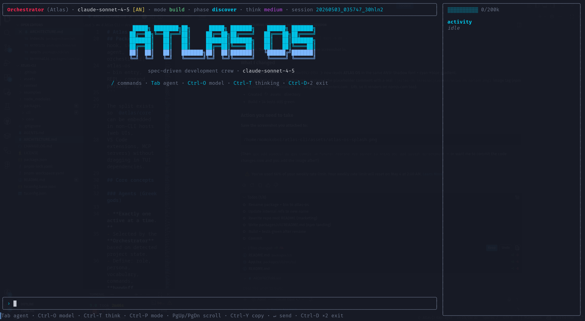

<div align="center">

# ATLAS·OS

**Autonomous Teams · Lifecycle · Agents · Skills — Orchestration System**

A multi-agent, hook-driven, model-agnostic engineering OS for the terminal.
Hand it a vague idea. Get back a planned, built, tested, committed feature —
with a Greek pantheon of specialist agents doing the work.

[](https://www.npmjs.com/package/atlas-os)
[](https://www.npmjs.com/package/atlas-os)
[](https://github.com/lucapohl-angel/atlas_CLI)
[](LICENSE)

<br>

```bash
npx atlas-os@latest
```

**Works on Mac, Windows, and Linux. Bring any model — Claude, GPT, Gemini, local Ollama, OpenRouter.**

<br>



<br>

[Why I Built This](#why-i-built-this) ·
[How It Compares](#how-it-compares) ·
[How It Works](#how-it-works) ·
[Install](#install) ·
[Walkthrough](./examples/sdd-walkthrough.md)

</div>

---

## Why I Built This

Atlas exists because most AI coding CLIs are either:

- a single chatbot that loses project context after a few prompts, or
- a heavyweight process framework with too much ceremony for small teams.

ATLAS·OS keeps the flow simple (`atlas`, describe the goal, ship) while keeping
the engine serious: multi-agent orchestration, typed tools, hook-based safety,
and a persistent context pack.

---

## How It Compares

| Capability | **ATLAS·OS** | Claude CLI | OpenCode CLI | Gemini CLI | Cursor Agent |
|---|---|---|---|---|---|
| Model choice | ✅ Anthropic, OpenAI, Google, OpenRouter, Ollama | ❌ Claude-focused | ⚠️ Varies | ❌ Gemini-focused | ⚠️ Mostly Claude/GPT |
| Multi-agent orchestration | ✅ Built in | ❌ | ❌ | ❌ | ⚠️ Limited |
| Spec-driven pipeline (PRD→arch→stories→impl→QA) | ✅ Built in | ❌ | ❌ | ❌ | ❌ |
| Hook guardrails (block/modify/allow) | ✅ Typed lifecycle hooks | ❌ | ❌ | ❌ | ❌ |
| Project context pack auto-injected | ✅ Six-file pack | ❌ | ❌ | ❌ | ❌ |
| Terminal-first default | ✅ `atlas` opens TUI | ✅ | ✅ | ✅ | ❌ Editor-first |

ATLAS·OS is built for teams that want autonomous execution without giving up
control, portability, or terminal-native speed.

---

## Install

```bash
# One-shot (latest)
npx atlas-os@latest

# Or install globally
npm install -g atlas-os
atlas
```

Set one provider key:

```bash
export OPENROUTER_API_KEY=sk-or-...     # default — gives you every model
export ANTHROPIC_API_KEY=sk-ant-...     # Claude direct
export OPENAI_API_KEY=sk-...            # GPT direct
export GOOGLE_API_KEY=...               # Gemini direct
```

Optional config (`~/.atlas/config.yaml`):

```yaml
defaultProvider: openrouter
defaultModel: anthropic/claude-sonnet-4.5
providers:
  openrouter:
    apiKey: sk-or-...
```

Bootstrap:

```bash
atlas init       # install built-in agents, skills, templates, checklists
atlas status     # the orchestrator tells you what to do next
atlas            # open the TUI
```

---

## How It Works

1. Run `atlas init` once in a project.
2. Launch with `atlas` and describe the goal.
3. The orchestrator routes work by project state:

```
no PRD            →  Athena       (PM — writes PRD)
PRD only          →  Prometheus   (architect — locks design)
arch, no pack     →  Athena       (scaffold the context pack)
pack, no stories  →  Hestia       (scrum master — breaks into stories)
stories ready     →  Hercules     (dev — implements)
implementation    →  Nemesis      (QA — verifies, files bugs)
verified          →  Iris         (release — ships)
```
4. Agents use typed tools, lifecycle hooks, and checklists to keep quality and
safety high while still moving fast.

See [examples/sdd-walkthrough.md](./examples/sdd-walkthrough.md) for a full run.

---

## Dev

Local build:

```bash
git clone https://github.com/lucapohl-angel/atlas_CLI.git
cd atlas_CLI
pnpm install
pnpm --filter @atlas/core build
pnpm --filter atlas-os build
node packages/cli/dist/bin/atlas.js doctor
```

Full quality gate:

```bash
pnpm --filter @atlas/core build && \
pnpm --filter @atlas/core test:run && \
pnpm --filter atlas-os typecheck && \
pnpm --filter atlas-os test:run && \
pnpm --filter atlas-os build
```

More detail: [ARCHITECTURE.md](./ARCHITECTURE.md), [AGENTS.md](./AGENTS.md), [context/](./context/)

---

## License

[MIT](./LICENSE).

---

<div align="center">

**Atlas·OS — your engineering crew lives in the terminal now.**

</div>
